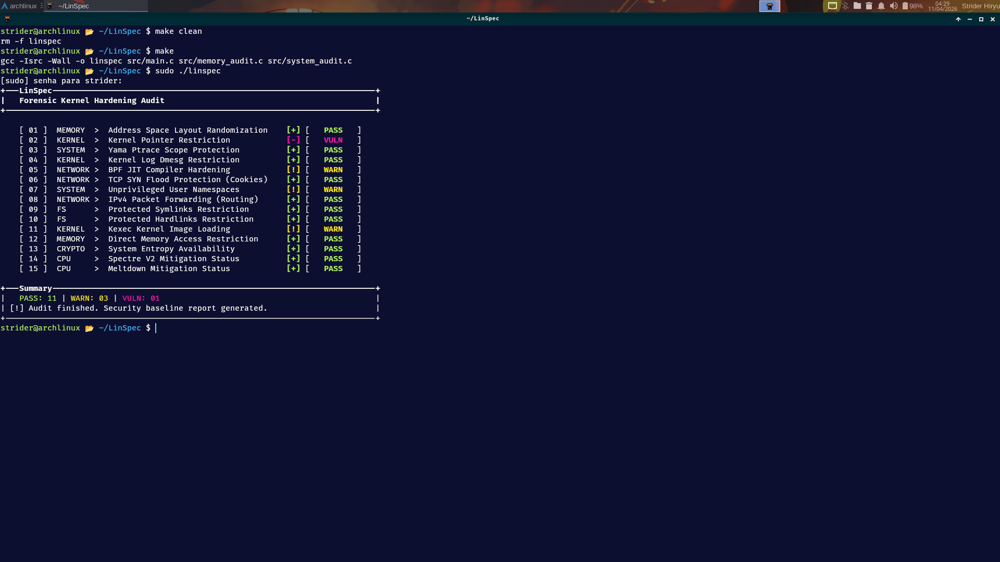
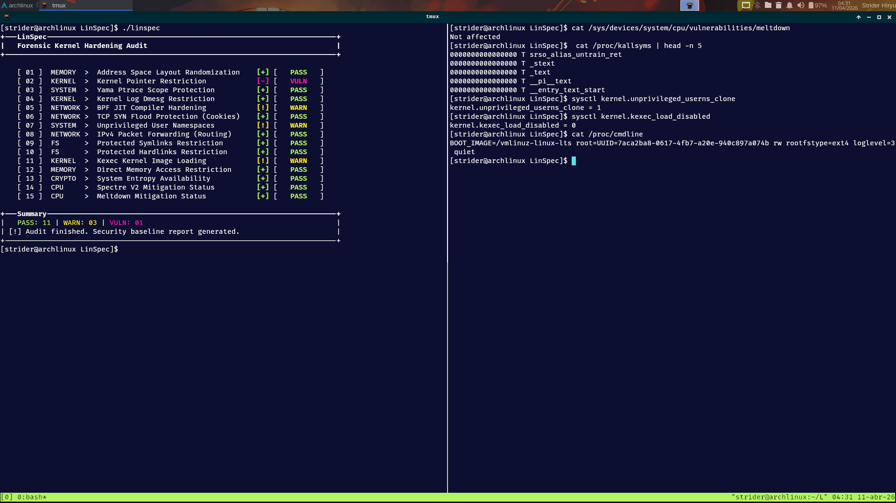
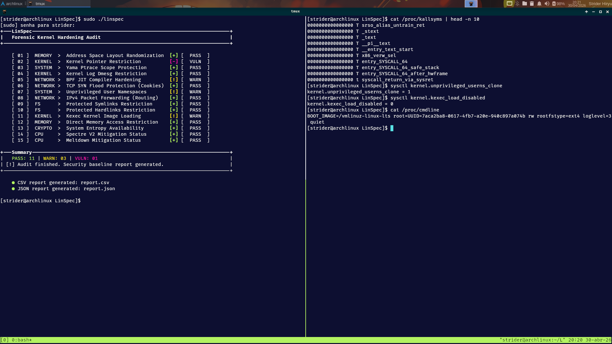

# 🐧 LinSpec

Lightweight forensic kernel hardening audit tool for Linux security baseline verification.

[](https://kernel.org)
[](https://gcc.gnu.org/)
[](LICENSE)
[](#-roadmap)
[](https://security.archlinux.org/)
[](./docs/forensic_methodology.md)

---

## ● Etymology & Origin

The name **LinSpec** is a portmanteau of **Linux** and **Inspection** (or Specification).

It was designed to act as the **"First Responder"** in a security audit. Before deep memory analysis begins, LinSpec inspects the kernel's defensive specifications to determine if the system's "armor" is correctly fastened or if there are gaps that an attacker could exploit.

---

## ● Overview

LinSpec is a specialized forensic utility designed to audit the security posture of the Linux Kernel in real-time.

It evaluates critical Kernel parameters, hardware mitigations, and system-level protection flags to generate a security baseline report. It serves as the **Initial Triage** phase in a forensic investigation.

**Core Audit Areas:**
- **Memory Protection:** `ASLR`, `NX`, and `DMA` restrictions
- **Kernel Hardening:** Pointer restrictions, `kexec` disabled, and `dmesg` visibility
- **CPU Mitigations:** Spectre and Meltdown mitigation status
- **Network Stack:** BPF JIT hardening and SYN Flood protection

---

## ● The Forensic Ecosystem

LinSpec is the first component of a specialized three-stage forensic workflow:

[-002B36?style=flat-square&logo=linux&logoColor=white)](#-linspec)
[-006400?style=flat-square&logo=linux&logoColor=white)](https://github.com/jeffersoncesarantunes/S.I.R.E.N)
[-003366?style=flat-square&logo=linux&logoColor=white)](https://github.com/jeffersoncesarantunes/K-Scanner)

---

## ● How It Works

LinSpec interfaces with:

- `/proc/sys`
- `/sys/devices`

Steps:

1. Retrieve Kernel parameters  
2. Evaluate against a hardened security baseline  
3. Validate CPU mitigation status  

---

## ● Example Output

```text
[ 01 ]  MEMORY   >  Address Space Layout Randomization     [+] [   PASS   ]
[ 02 ]  KERNEL   >  Kernel Pointer Restriction             [-] [   VULN   ]
[ 03 ]  SYSTEM   >  Yama Ptrace Scope Protection           [+] [   PASS   ]
[ 04 ]  KERNEL   >  Kernel Log Dmesg Restriction           [+] [   PASS   ]
[ 05 ]  NETWORK  >  BPF JIT Compiler Hardening             [!] [   WARN   ]
[ 06 ]  NETWORK  >  TCP SYN Flood Protection (Cookies)     [+] [   PASS   ]
[ 07 ]  SYSTEM   >  Unprivileged User Namespaces           [!] [   WARN   ]
```

---

## ● Forensic Artifacts

After execution, LinSpec automatically generates structured reports for external analysis:

- `report.json`: Machine-readable data for automated forensic pipelines and **S.I.R.E.N** integration.
- `report.csv`: Tabular data for spreadsheet analysis and documentation.

---

## ● Project in Action

  
*1 - System Audit Overview. Clean compilation and execution of the forensic engine, performing the initial security baseline triage.*

  
*2 - Data Integrity & Reporting. Cross-referencing terminal output with generated JSON/CSV reports to ensure data consistency and structural integrity.*

  
*3 - Forensic Kernel Validation. Deep-dive validation between LinSpec findings and live kernel state through /proc/kallsyms, sysctl interfaces, and boot parameters.*

---

## ● Build and Run

```bash
# 1. Clone the repository
git clone https://github.com/jeffersoncesarantunes/LinSpec.git

# 2. Enter the directory
cd LinSpec

# 3. Compile the project
make clean && make

# 4. Run with root privileges for full access
sudo ./linspec
```

---


## ● Investigation Workflow

1. Entry point analysis (`ptrace`)
2. `KASLR` validation
3. CPU trust verification

---

## ● Technical Validation & Evidence

To confirm the audit's accuracy, the following commands can be used to manually verify the forensic artifacts and the live kernel state:

**1. Verifying Structured Reports:**

```bash
# Preview CSV report in tabular format
column -s, -t < report.csv

# Extract audit summary from JSON report
cat report.json | grep -A 4 "summary"
```

**2. Verifying Kernel Constraints:**

```bash
# Proof of Kernel Pointer Restriction (addresses should be zeroed)
cat /proc/kallsyms | head -n 10

# Checking active sandboxing and boot parameters
sysctl kernel.unprivileged_userns_clone
sysctl kernel.kexec_load_disabled
cat /proc/cmdline
```

---

## ● Features

- Real-time Kernel auditing      
- CPU vulnerability detection  
- **Forensic Data Export (JSON/CSV)**  
- Minimalist terminal UI  
- Pure C99 (no dependencies)  
- PASS / WARN / VULN reporting  
- Passive inspection  

---

## ● Operational Integrity

- **Passive Audit Mode:** Current version performs non-intrusive inspection (read-only).
- **Stateless execution:** No system configurations are modified during the audit 

---

## ● Repository Structure

```text
├── docs/
│   ├── architecture.md
│   ├── audit_reference.md
│   ├── forensic_methodology.md
│   └── threat_model.md
├── Imagens/
│   ├── linspec1.png
│   ├── linspec2.png
│   └── linspec3.png
├── include/
├── src/
│   ├── checks.h
│   ├── main.c
│   ├── memory_audit.c
│   └── system_audit.c
├── report.csv
├── report.json
├── LICENSE
├── Makefile
└── README.md
```

---

## ● Tech Stack

- **Language:** C (C99)
- **Data Sources:** `/proc` and `/sys` interfaces
- **Build Tool:** GNU Make
- **Target Platforms:** Linux Kernel 4.x, 5.x, 6.x    

---

## ● Roadmap

- [x] High-performance C99 Core Engine
- [x] Side-channel Vulnerability Detection (Spectre/Meltdown)
- [x] Brutalist-inspired Terminal UI
- [x] Structured Output (JSON/CSV Export for Forensics)
- [ ] Automated Remediation (System Hardening Scripts)
- [ ] Ecosystem Integration (Pre-acquisition Audit for S.I.R.E.N)

---

## ● Documentation

[](./docs/architecture.md)
[](./docs/forensic_methodology.md)
[](./docs/audit_reference.md)
[](./docs/threat_model.md)

---

## ● License

[](./LICENSE)

*This project is licensed under the MIT License.*
